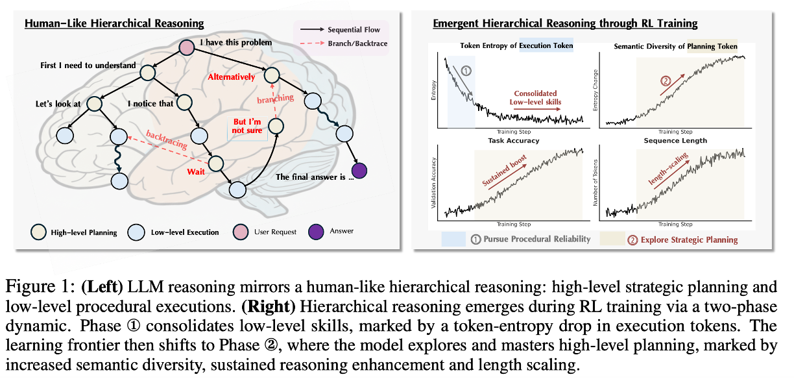

# Emergent Hierarchical Reasoning in LLMs through Reinforcement Learning

[Haozhe Wang](https://haozheh3.github.io), Qixin Xu, Che Liu, Junhong Wu, [Fangzhen Lin](https://cse.hkust.edu.hk/~flin/), [Wenhu Chen](https://wenhuchen.github.io/)

*Hong Kong Univerisity of Science and Technology, University of Waterloo, M-A-P, Tsinghua Univerisity, Imperial College London, UCAS*

[](https://arxiv.org/pdf/2509.03646) [](https://huggingface.co/collections/TIGER-Lab/hierarchical-reasoner-68c183451eadc248ee43ff59)


## 📖 TL;DR
Reinforcement Learning (RL) has been a game-changer for teaching LLMs complex reasoning, but how it works has been a mystery. Puzzling behaviors like sudden "aha moments," and performance boosts from longer answers ("length-scaling") have been observed, but not understood.

In this work, we reveal that these are not random quirks. They are the hallmarks of **an emergent reasoning hierarchy, where the model learns to reason much like a human: by separating high-level strategic planning from low-level procedural execution.** We show this process unfolds in two overlapping phases and leverage this insight to create a more efficient RL algorithm.

<p align="center">

</p>

## 🚀 Release Plan

We are committed to making our work accessible and reproducible. 

Stay tuned for updates\!


## 🍊 Citation

If you find our work useful for your research, please consider citing our paper:

```bibtex
@article{wang2025emergent,
  title={Emergent Hierarchical Reasoning in LLMs through Reinforcement Learning},
  author={Wang, Haozhe and Xu, Qixin and Liu, Che and Wu, Junhong and Lin, Fangzhen and Chen, Wenhu},
  journal={arXiv preprint:2509.03646},
  year={2025}
}
```
